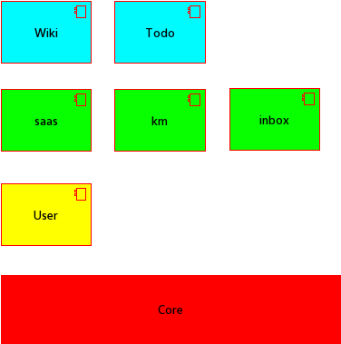

# Pluf core

This project is part of pluf.

Pluf is open source light RESTFull framework. 

There are severall opensource modules to extend pluf.

## مدل توسعه

ساختار در نظر گرفته شده برای پیاده‌سازی سیستم‌ها MVT است که از سه بخش مدل، نمایش و الگو تشکیل می‌شود. 

مدل ساختارهای داده‌ای و روش‌های دستکاری آنها را تعیین می‌کند.

نمایش، با استفاده از کنترلرها، امنیت، مسیر‌های دسترسی و سایر امکانات دسترسی کاربران به داده‌ها را فراهم می‌کند.

الگو ساختارهای داده‌ای را تعیین می‌کند که باید برای کاربران ارسال شود.

## معماری

## امکانات

- Multi tenant support
- REST full
- Sessiong management
- Security layer
- Plug and play

# حق نشر

این بسته توسط شرکت دانش پژوهان ققنوس توسعه یافته است:

[Phoinex Scholars Co.](http://dpq.co.ir)

