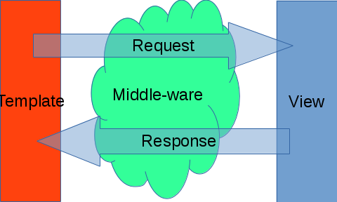

# میان افزارها

در بسیاری از موارد نیاز است که پیش از اجرای هر نمایش و یا پس از اجرای نمایش دسته‌ای از پردازش‌ها روی تقاضا و نتیجه انجام شود. اینگونه پردازش‌ها توسط میان‌افزارها انجام می‌شود. نمای کلی یک میان افزار و رابطه آن با ساختار کلی سیستم در شکل زیر نمایش داده شده است.

برای نمونه فرض کنید که بخواهیم هر فراخوانی که منجر به تغییر داده در ساختارهای سیستم می‌شود را مصدود کنیم و از اجرای آن جلوگیری کنیم. برای این کار یک میان افزار ایجاد کرده و تمام فراخوانی‌هایی که با متد POST انجام می‌شود را با خطا پاسخ می‌دهیم.

## ساختار یک میان افزار

یک میان افزار در حقیقت یک پیاده سازی از واسط زیر است:

	interface Pluf_Middleware {
		function process_request(&$request);
		function process_response($request, $response);
	}

فراخوانی process_request تقاضای و process_response نتیجه تقاضا را بررسی می‌کند. 

## پردازش تقاضا

خروجی پردازش تقاضا اگر مقدار نادرستی باشد به این معنی است که پردازش به صورت کامل انجام شده و نیاز به متوقف کردن فرآیند پردازش تقاضا نیست. در غیر این صورت نتیجه‌ای که به عنوان پردازش برگردانده شده به صورت پاسخ برای کاربر ارسال می‌شود.

برای نمونه تابع زیر را در نظر بگیرید.

	function process_request(&$request){
		...
       if ($request->POST['csrfmiddlewaretoken'] != $token) {
			return new Pluf_HTTP_Response_Forbidden($request);
       }
		return false;
	}

در صورتی که توکن مورد نظر در سرآیند تقاضا یافت نشود، فراخوانی بلاکه شده و خطای دسترسی غیر مجاز فراخوانی می‌شود. در غیر این صورت با برگرداندن مقدار نادرستی فرآیند اجرا ادامه می‌یابد.

## پردازش نتیجه

برخلاف پردازش تقاضا، پردازش نتیجه فرآیند اجرا را تغییر نمی‌دهد. هدف اصلی از پردازش نتیجه اضافه کردن داده‌هایی است که نتیجه را تکمیل کند. برای نمونه برای جلوگیری از حمله می‌توان کلید‌های خاصی را در نتیجه یک تقاضا جا داد و انتظار داشت که در تقاضای بعدی آنها را مشاهده کرد.

