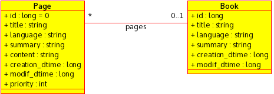

# ویکی

پایه بسیاری از سیستم‌های مبتنی به سند را ایجاد می‌کند.

از ماژول‌های زیر استفاده می‌شود:

- user
- saas
- km

## مدل منطقی

### صفحه

یک محتوی است که بر اساس یک ساختار خاص نوشته می‌شود.

### کتاب

یک کتاب مجموعه‌ای از صفحه‌ها است که این صفحه‌ها در این کتاب یک ترتیب خاص دارند.