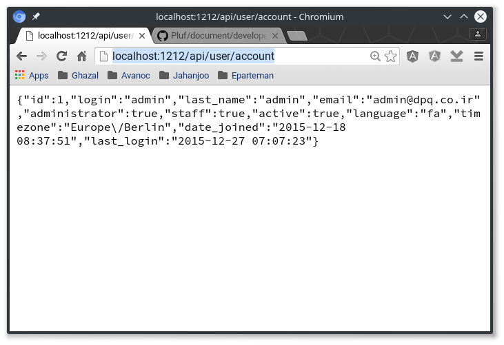

# دسترسی به سرور

اولی نیاز برای توسعه یک برنامه جدید درستی به قابلیت‌هایی است که توسط سرور ایجاد شده است.

سرور به صورت یک سرویس محلی شبه سازی می‌شود و نرم‌افزار ایجاد شده به صورت یک برنامه نصب شده روی یک مسیر موقت نگاشت می‌شود.

برای ادامه فرض‌های زیر را در نظر گرفته‌ایم:

- یک ملک روی سرور ایجاد کرده‌اید
- اطلاعات کاربری آن را دارید

## نصب

این نرم افزار برای سیستم‌های ویندوز و لینوکس پیاده سازی شده است.

- [nginx](http://nginx.com)

### ویندوز

برای نصب مستند زیر رو مطالعه کنید:

- [Install on Windows](http://nginx.org/en/docs/windows.html)

### OpenSuse

برای نصب دستور زیر را وارد کنید.

	sudo zypper install nginx

# راهاندازی

برای راهاندازی سرور به صورت محلی به دو کار اصلی نیاز است: تنظیم و اجرا.

همانگونه که گفتیم این برنامه برای ایجاد یک سرور محلی به کار گرفته میشود که بخشی از آن محلی و بخشی یک سرور حقیقی دیگر است. این که چه بخشی از سیستم باید محلی و کدام بخش از سرور دیگر باید باشد توسط تنظیمها تعیین میشود.

در نهایت بعد از ایجاد تنظیمها باید سرور را اجرا کرد تا از قابلیتهای آن برای توسعه نرم افزار استفاده کرد. در ادامه این دو کار به صورت جداگانه تشریح شده است.
	
## تنظیم‌ها

تنظیمها با استفاده از یک زبان ساده ایجاد میشود که توصیف کامل آن در زیر آمده است:

- [nginx documentation](http://nginx.org/en/docs/beginners_guide.html)

در اینجا تنها نکتههای مهم مربوط به این تنظیمها آورده شده است.

### pid

با اجرای سرور شماره پردازش در یک پرونده ذخیره میشود تا در صورت نیاز به متوقف کردن، شماره پردازش در دسترس باشد. این پرونده با استفاده از خصوصیت pid به صورت زیر تعیینی میشود. برای نمونه:

	pid /var/run/nginx.pid;
	
معادل آن در ویندوز به صورت زیر است:

	pid C:\nginx.pid;

### انواع پروندهها

تعیین mimetype برای تمام پروندهها به خصوص آنهایی که در نمایش به کار می رود مهم است و در صورتی که نوع آنها متناسب با کار آنها نباشد توسط کاوشگرهای اینترنتی بلاکه میشوند. تعیین نوعها با استفاده از یک مخزن انواع تعیین میشود که باید به صورت زیر اضافه شود:

    include /path/to/mime.types;

یک نمونه از این پرونده در مسیر زیر قرار دارد:

- [Mimetypes in Pluf](https://github.com/phoenix-scholars/Pluf/tree/master/document/developer/assets/mime.types)
- [Mimetypes in Linux](/etc/mime.types)
- [Mimetypes of nginx in Linux](/etc/nginx/mime.types)

یک نمونه از این پرونده در مسیر نصب nginx وجود دارد.

### سرور

مهمترین بخش  تنظیم سرور است. این تنظیمها شامل حداقل دو بخش است که یکی محلی و دیگری سرور اصلی است. این دو بخش به صورت زیر تعیین میشود:

    location / {
        root /path/to/spa/repo/pluf-spa;
    }
    location /api {
        proxy_pass http://remoteservr.pluf.ir;
    }

قسمت اول که با مسیر / تعیین شده مسیری از سیستم شما را تعیین میکند که تمام نرم افزارهای شما در آن قرار دارد. برای نمونه اگر نرم افزار help را مینویسید باید در مسیر تعیین شده پوشه پروزه شما وجود داشته باشد.

قسمت دوم سروری را تعیین میکند که شما میخواهید از آن به صورت محلی استفاده کنید.

### نمونه نهایی

        #user  nginx;
	worker_processes  1;
	pid /var/run/nginx.pid;
	events {
	    worker_connections  1024;
	    use epoll;
	}
	http {
	    include /etc/nginx/mime.types;
	    server {
	        listen 1212;
	        charset utf8;
	        location / {
	            root /home/maso/git/pluf-spa;
	        }
	        location /api {
	            proxy_pass http://developer.pluf.ir;
	        }
	    }
	}

## اجرا

اجرا نیازمند به پرونده تنظیمها است. در صورتی که پروندهای برای آن تعیین نشود از تنظیمهای پیش فرض برای اینکار استفاده خواهد شد.

برای اجرای دستور زیر را وارد کنید

	sudo nginx -c /path/to/nginx.conf

در صورتی که از ویندوز استفاده میکنید این دستور مشابه با حالت زیر خواهد بود:

        nginx.exe -c C:\path\to\nginx.conf

این دستور را باید در CMD اجرا کنید و مطمئن باشید که مسیر نصب را به PATH اضافه کردهاید.

اگر تنظیم‌ها تغییر کرده بود و نیاز به اجرای مجدد داشتید

	sudo nginx -s reload -c /path/to/nginx.conf
	

## تست

برای تست یک کاوشگر باز کنید و آدرس زیر را در بالا آن وارد کنید:

    http://localhost:1212

یک صفحه به صورت زیر باید نمایش داده شود:

برای تست قسمت سرور اصلی نیز آدرس زیر را وارد کنید:

    http://localhost:1212/api/user/account

این فراخوانی اطلاعات کاربر جاری را نمایش میدهد. در نهایت باید صفحه زیر را مشاهده کنید:

