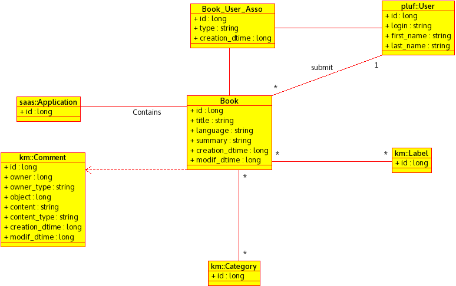

## کتاب

هر کتاب توسط یک کاربر ایجاد می‌شود که بالاترین سطح دسترسی به کتاب را دارد.

هر کتاب می‌تواند در یک دسته قرار گیرد.

هر کتاب می‌تواند برچسب‌های متفاوتی داشته باشد.

هر فرد می‌تواند رو یک کتاب کامت بزاره و نظرش رو بده.

## صفحه

هر صفحه توسط یک فرد ایجاد می‌شود و تا اخر نگهداری می‌شود که کی این را ایجاد کرد. ایجاد کنند بالاترین دسترسی به صفحه را دارد.

هر صفحه در یک دسته قرار می‌گیرد.

هر صفحه می‌تواند برچسب گذاری شود.

هر فردی می‌تواند روی یک صفحه کامت بزارد. 

